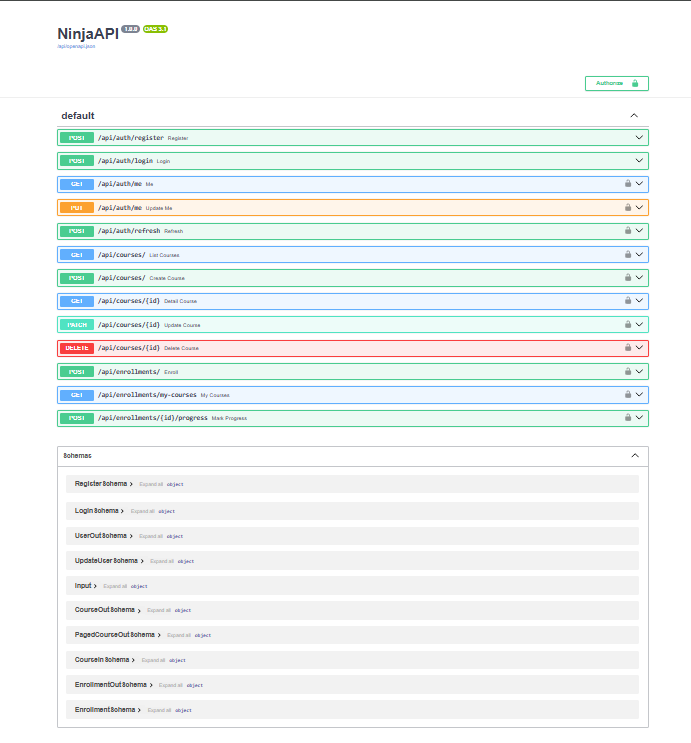
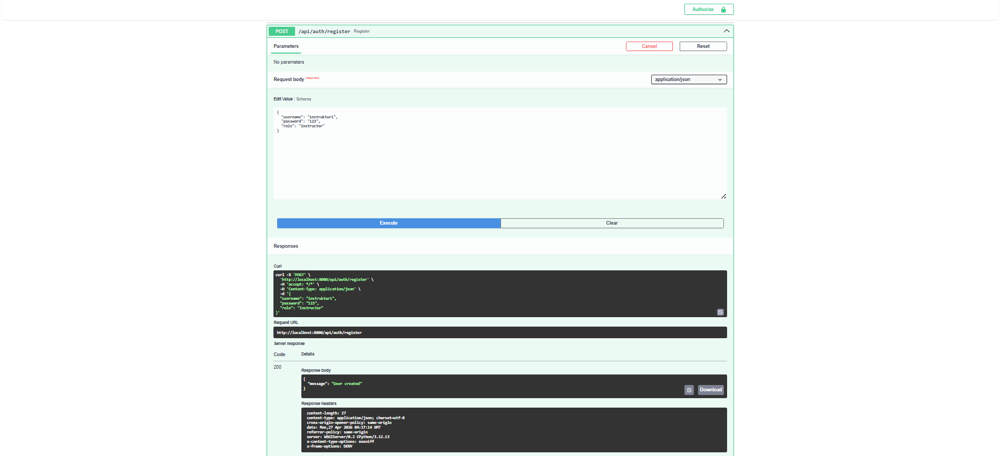
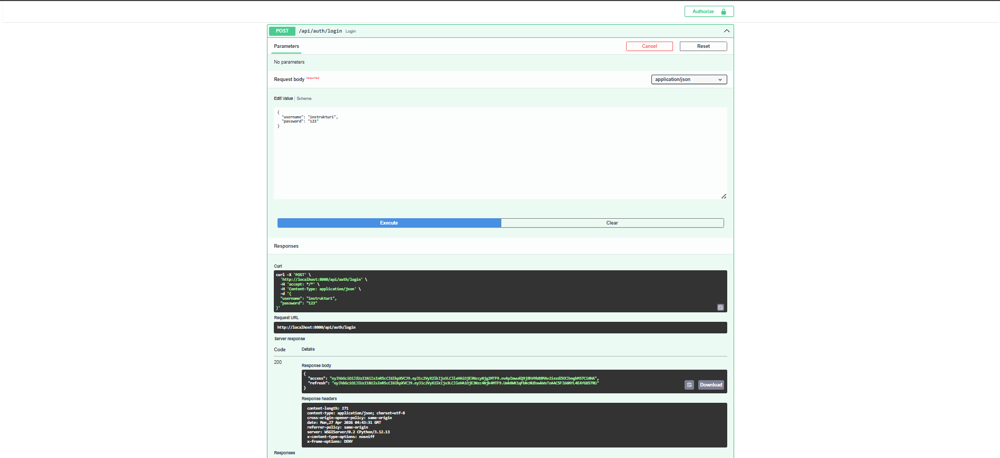
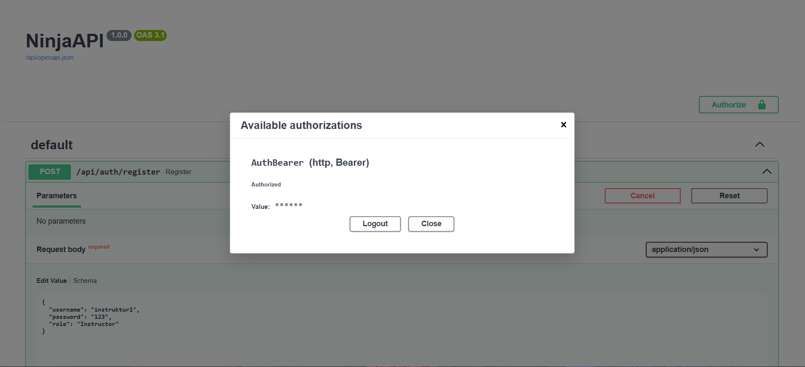
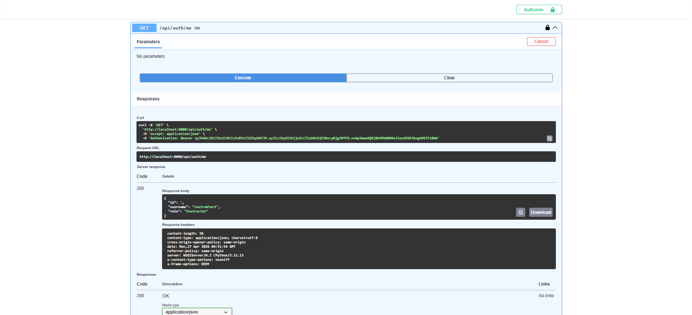
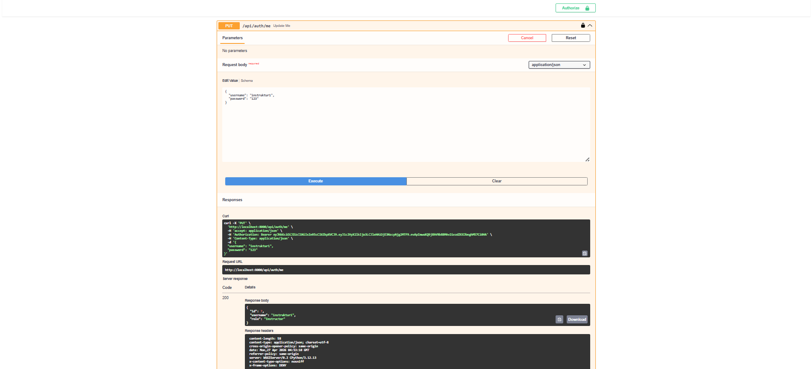
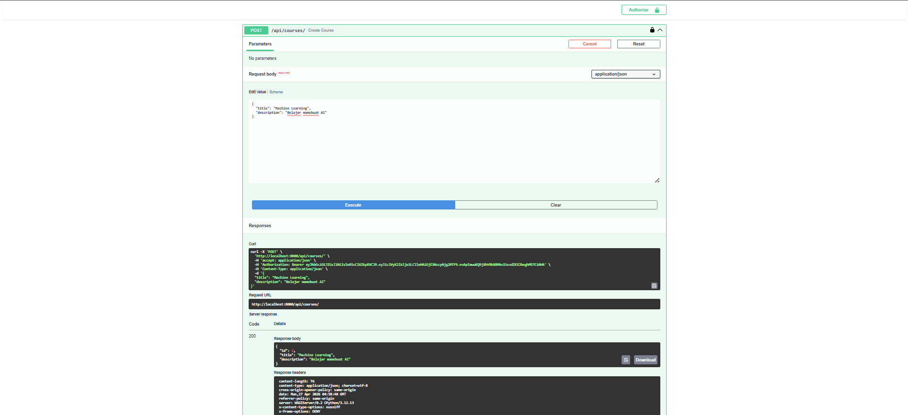

````markdown
# 👨‍💻 Author

Nama: Mahammad Ibadullah  
NIM: A11.2023.15275

Project ini dibuat untuk keperluan pembelajaran Docker + Django + REST API.

---

# 📚 Simple LMS - Django + PostgreSQL + Docker

Project ini adalah setup dasar **Learning Management System (LMS)** menggunakan **Django**, **PostgreSQL**, dan **Docker**.

Project ini telah dikembangkan hingga tahap **Progress 3: REST API & Authentication System** menggunakan **Django Ninja**, **JWT Authentication**, dan **Role-Based Access Control (RBAC)**.

---

# 🚀 Cara Menjalankan Project

## 1. Clone Repository

```bash
git clone <repo-url>
cd simple-lms
````

## 2. Jalankan Docker

```bash
docker compose up --build
```

## 3. Akses Aplikasi

```text
http://localhost:8000
```

## 4. API Documentation (Swagger)

```text
http://localhost:8000/api/docs
```

## 5. Django Admin

```text
http://localhost:8000/admin
```

---

# ⚙️ Environment Variables

Konfigurasi environment terdapat pada file `.env`

Contoh:

```env
DEBUG=True
SECRET_KEY=django-insecure-key

DB_NAME=lms_db
DB_USER=lms_user
DB_PASSWORD=lms_password
DB_HOST=db
DB_PORT=5432
```

---

# 🐳 Services yang Digunakan

## 1. Web (Django)

* Menjalankan aplikasi Django
* Port `8000`

## 2. Database (PostgreSQL)

* Database utama
* Port `5432`

---

# 🧱 Struktur Project

```text
simple-lms/
├── docker-compose.yml
├── Dockerfile
├── requirements.txt
├── manage.py
├── config/
├── api/
│   ├── router.py
│   ├── auth.py
│   ├── auth_bearer.py
│   ├── courses.py
│   ├── enrollments.py
│   ├── permissions.py
│   ├── schemas.py
│   └── views.py
├── lms/
│   ├── models.py
│   ├── admin.py
│   ├── managers.py
│   └── migrations/
└── images/
```

---

# 🗄️ Data Models

Model utama menggunakan Django ORM:

* **User** (custom user dengan role: admin, instructor, student)
* **Category** (kategori course)
* **Course** (relasi instructor & category)
* **Lesson** (relasi ke course)
* **Enrollment** (student mengambil course)
* **Progress** (tracking lesson selesai)

---

# 🚀 Progress 3: REST API & Authentication System

Progress ini berfokus pada pembuatan REST API lengkap menggunakan **Django Ninja**.

---

# 🎯 Learning Objectives

* Membuat REST API dengan Django Ninja
* Schema validation menggunakan Pydantic
* JWT Authentication implementation
* Role-Based Access Control (RBAC)
* API documentation dengan Swagger UI

---

# 📦 API Endpoints

# 🔐 Authentication

## Register User

```http
POST /api/auth/register
```

## Login User

```http
POST /api/auth/login
```

Return:

* Access Token
* Refresh Token

## Refresh Token

```http
POST /api/auth/refresh
```

## Current User

```http
GET /api/auth/me
```

## Update Profile

```http
PUT /api/auth/me
```

---

# 📚 Courses (Public)

## List Courses

```http
GET /api/courses
```

Fitur:

* Pagination
* Search filter
* Category filter

## Course Detail

```http
GET /api/courses/{id}
```

---

# 🛡️ Courses (Protected)

## Create Course (Instructor Only)

```http
POST /api/courses
```

## Update Course (Owner Only)

```http
PATCH /api/courses/{id}
```

## Delete Course (Admin Only)

```http
DELETE /api/courses/{id}
```

---

# 🎓 Enrollments

## Enroll Course

```http
POST /api/enrollments
```

(Student only)

## My Courses

```http
GET /api/enrollments/my-courses
```

## Mark Progress

```http
POST /api/enrollments/{id}/progress
```

---

# 🔑 Authentication System

Project ini menggunakan **JWT Authentication**

Fitur:

* Access Token
* Refresh Token
* Token validation middleware
* Password hashing Django

---

# 👮 Permission System (RBAC)

Role yang digunakan:

* **Admin**
* **Instructor**
* **Student**

Decorator permission:

```python
@is_admin
@is_instructor
@is_student
```

Tambahan:

* Ownership validation pada update course
* Instructor hanya dapat mengubah course miliknya
* Admin dapat menghapus semua course

---

# 📐 Schema Validation (Pydantic)

Semua request & response menggunakan schema Django Ninja / Pydantic:

```python
UserRegisterSchema
LoginSchema
CourseCreateSchema
CourseUpdateSchema
EnrollmentSchema
ProgressSchema
```

---

# 📘 API Documentation

Swagger UI otomatis tersedia di:

```text
http://localhost:8000/api/docs
```

Digunakan untuk:

* Testing endpoint langsung
* Melihat request body schema
* Authorization Bearer Token
* Response documentation

---

# 📬 Postman Collection

Disediakan collection Postman untuk testing endpoint:

```text
Simple-LMS.postman_collection.json
```

---

# 🛠️ Perintah Penting

## Migration

```bash
docker compose exec web python manage.py makemigrations
docker compose exec web python manage.py migrate
```

## Create Superuser

```bash
docker compose exec web python manage.py createsuperuser
```

## Masuk Container

```bash
docker compose exec web bash
```

## Lihat Logs

```bash
docker logs lms_web
```

---

# ⚠️ Troubleshooting

## Database tidak connect

Gunakan:

```env
DB_HOST=db
```

## Perubahan tidak muncul

```bash
docker compose up --build
```

## Container error

```bash
docker logs lms_web
```

---

# 📸 Screenshot Bukti Progress

# Progress 1

## Tampilan Awal Django

```md

```

## Setup Berhasil

```md

```

## Migration & Superuser

```md

```

---

# Progress 2

## Makemigrations & Migrate

```md

```

## Admin Dashboard

```md

```

## Query Optimization

```md

```

---

# Progress 3

## Swagger Documentation

```md

```

## Register API Success

```md

```

## Login JWT Token

```md

```

## Get Current User

```md

```

## Course Endpoint

```md

```

## Enrollment Endpoint

```md

```

## Protected Endpoint JWT

```md

```

## Postman Testing

```md

```

---

# ✅ Checklist

* [x] Docker berjalan
* [x] Django tampil
* [x] PostgreSQL terhubung
* [x] Models selesai
* [x] REST API selesai
* [x] JWT Authentication selesai
* [x] RBAC selesai
* [x] Swagger UI aktif
* [x] Postman collection tersedia
* [x] Screenshot lengkap

---

# 🎯 Kesimpulan

Project **Simple LMS Progress 3** berhasil mengimplementasikan:

* Django Ninja REST API
* JWT Authentication
* Refresh Token System
* Role-Based Access Control
* Schema Validation dengan Pydantic
* Swagger API Documentation
* Postman Testing Collection
* Docker-based development system

---

# 📌 Next Step

* Upload file materi course
* Quiz & Assignment API
* Payment system
* Frontend React / Next.js
* Deploy ke VPS / Cloud

```
```
