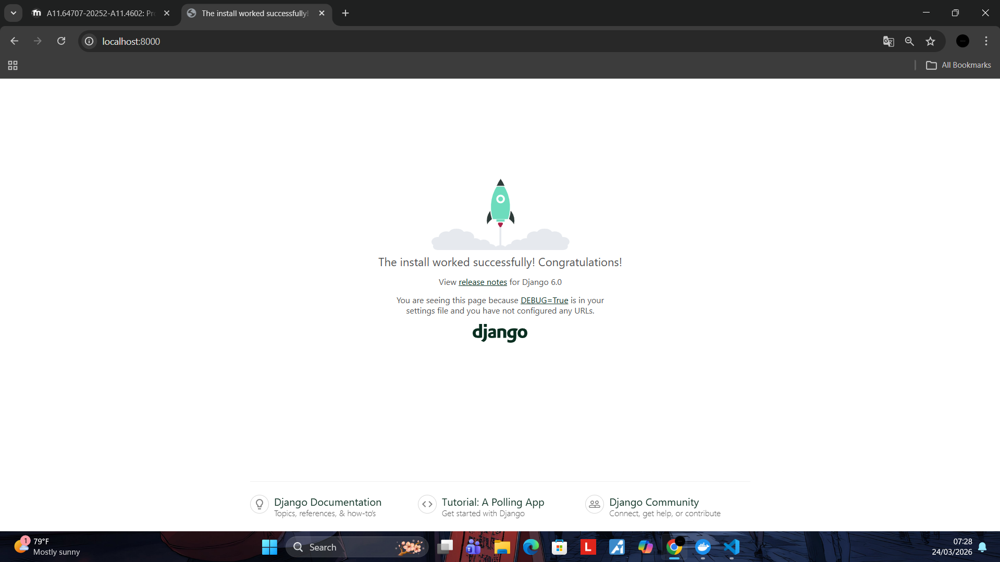
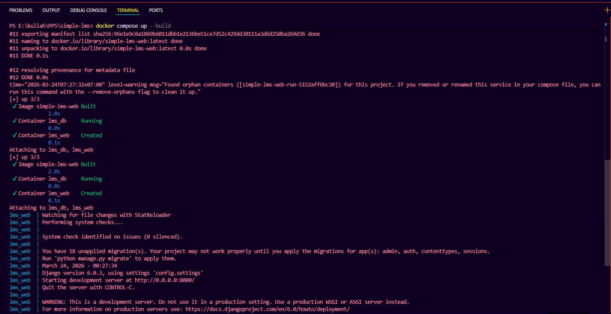
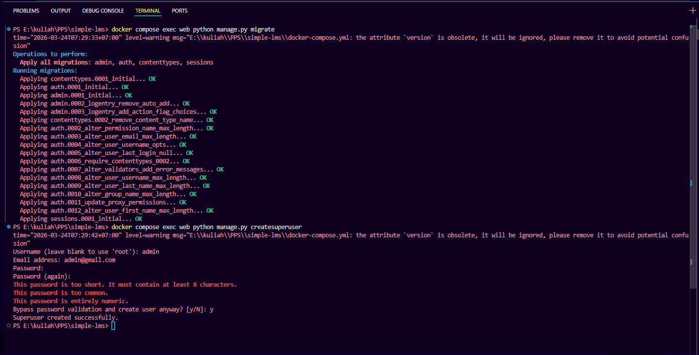
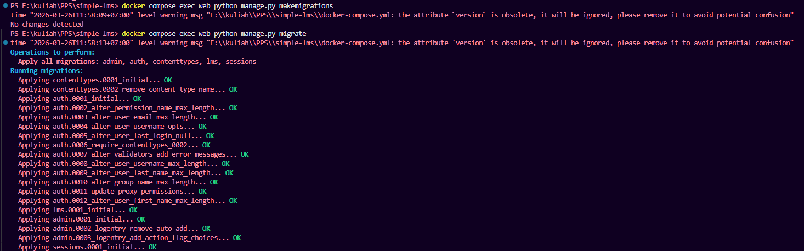
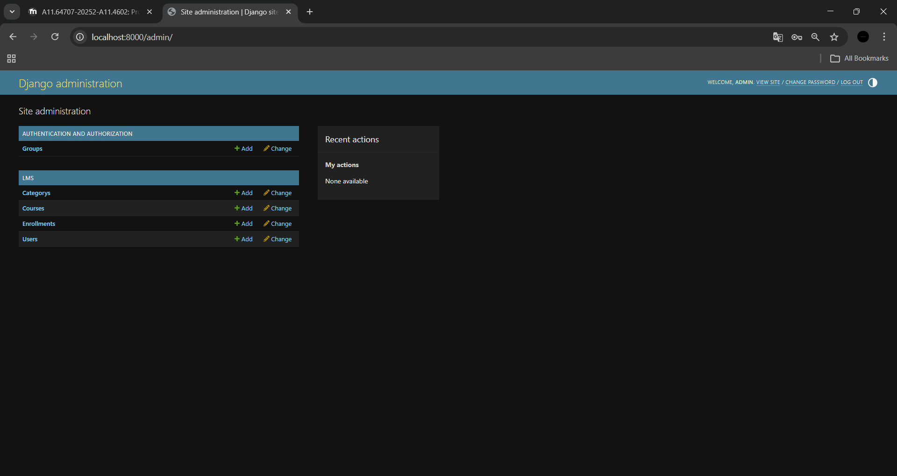
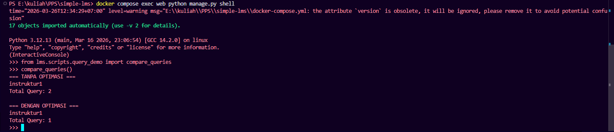

# 👨‍💻 Author

Nama: Mahammad Ibadullah
NIM: A11.2023.15275

Project ini dibuat untuk keperluan pembelajaran Docker + Django.

---

# 📚 Simple LMS - Django + PostgreSQL + Docker

Project ini adalah setup dasar **Learning Management System (LMS)** menggunakan **Django**, **PostgreSQL**, dan **Docker**. Project ini dikembangkan hingga tahap **Database Design & ORM Implementation (Progress 2)**.

---

# 🚀 Cara Menjalankan Project

### 1. Clone Repository

```bash
git clone <repo-url>
cd simple-lms
```

---

### 2. Jalankan Docker

```bash
docker compose up --build
```

---

### 3. Akses Aplikasi

Buka browser:

```
http://localhost:8000
```

Jika berhasil, akan muncul halaman default Django 🚀

---

### 4. Akses Django Admin

```
http://localhost:8000/admin
```

---

# ⚙️ Environment Variables

Konfigurasi environment terdapat pada file `.env`.

Contoh:

```env
DEBUG=True
SECRET_KEY=django-insecure-key

DB_NAME=lms_db
DB_USER=lms_user
DB_PASSWORD=lms_password
DB_HOST=db
DB_PORT=5432
```

---

# 🐳 Services yang Digunakan

### 1. Web (Django)

* Menjalankan aplikasi Django
* Port: `8000`

### 2. Database (PostgreSQL)

* Database utama
* Port: `5432`
* Data disimpan di volume Docker

---

# 🧱 Struktur Project

```
simple-lms/
├── docker-compose.yml
├── Dockerfile
├── .env
├── .env.example
├── requirements.txt
├── manage.py
├── config/
├── lms/
│   ├── models.py
│   ├── admin.py
│   ├── managers.py
│   ├── scripts/
│   │   └── query_demo.py
│   └── migrations/
```

---

# 🗄️ Data Models (Progress 2)

Model yang dibuat menggunakan Django ORM:

* **User** (custom user dengan role: admin, instructor, student)
* **Category** (self-referencing hierarchy)
* **Course** (relasi ke instructor & category)
* **Lesson** (relasi ke course dengan ordering)
* **Enrollment** (relasi student-course dengan unique constraint)
* **Progress** (tracking penyelesaian lesson)

---

# ⚡ Query Optimization

Menggunakan:

* `select_related`
* Custom QuerySet (`managers.py`)

---

## 🔬 Demo Query Optimization

File:

```
lms/scripts/query_demo.py
```

---

## 📊 Hasil Perbandingan Query

```text
=== TANPA OPTIMASI ===
instruktur1
Total Query: 2

=== DENGAN OPTIMASI ===
instruktur1
Total Query: 1
```

---

## 🧠 Penjelasan

Tanpa optimasi, Django mengalami **N+1 problem**, yaitu setiap relasi memicu query tambahan.

Dengan `select_related`, Django melakukan JOIN sehingga hanya menggunakan **1 query**.

---

# 🗄️ Perintah Penting

### Migrasi Database

```bash
docker compose exec web python manage.py makemigrations
docker compose exec web python manage.py migrate
```

---

### Membuat Superuser

```bash
docker compose exec web python manage.py createsuperuser
```

---

### Masuk ke Container

```bash
docker compose exec web bash
```

---

### Melihat Container Aktif

```bash
docker ps
```

---

### Melihat Log

```bash
docker logs lms_web
```

---

### Stop Project

```bash
docker compose down
```

---

# 📂 Static Files

```python
STATIC_URL = 'static/'
STATIC_ROOT = os.path.join(BASE_DIR, 'staticfiles')
```

---

# ⚠️ Troubleshooting

### ❌ Tidak bisa konek ke database

Gunakan:

```env
DB_HOST=db
```

---

### ❌ Container error

```bash
docker logs lms_web
```

---

### ❌ Perubahan tidak muncul

```bash
docker compose up --build
```

---

# 📸 Screenshot

## Progress 1

### Tampilan awal Django



### Succes Setup and Instalasi



### Migration and create super user



---

## Progress 2

### Makemigrations & Migrate



---

### Super Admin Login Dashboard



---

### Query Optimization Comparison



---

# 📊 Kriteria Penilaian

| Kriteria           | Status |
| ------------------ | ------ |
| Models & Relasi    | ✅      |
| Query Optimization | ✅      |
| Django Admin       | ✅      |
| Migration          | ✅      |
| Dokumentasi Query  | ✅      |

---

# 📤 Cara Upload ke GitHub

```bash
git init
git add .
git commit -m "Simple LMS Progress 2"
git branch -M main
git remote add origin <repo-url>
git push -u origin main
```

---

# ✅ Checklist

* [x] Docker berjalan
* [x] Django tampil
* [x] PostgreSQL terhubung
* [x] Migrasi berhasil
* [x] Models & relasi selesai
* [x] Query optimization selesai
* [x] Django Admin berjalan
* [x] Screenshot lengkap

---

# 🎯 Kesimpulan

Project berhasil mengimplementasikan:

* Database design dengan Django ORM
* Relasi kompleks antar model
* Query optimization menggunakan `select_related`
* Demonstrasi N+1 problem
* Django Admin interface
* Docker-based development

---

# 📌 Next Step

* API (Django REST Framework)
* Frontend UI
* Sistem course lengkap
* Quiz & assignment

---
